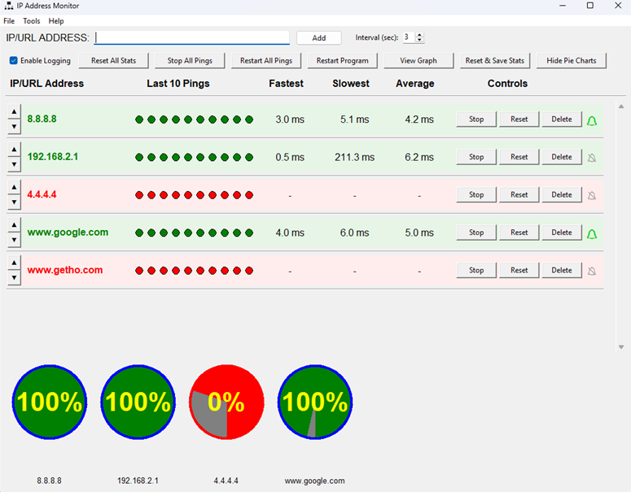
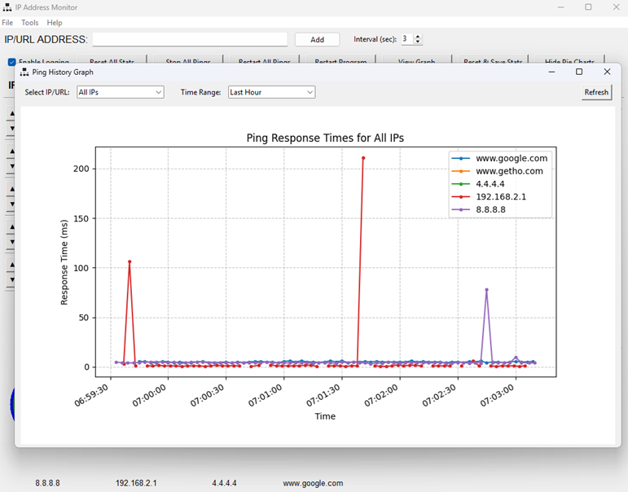

# IP Monitor 

  
  
  

  

English Version

## History 

I've been migrating and upgrading network equipment since Genesis, chapter 1, verse 1, and I always routinely run a series of pings from a CMD window in Windows or Linux to see, in real time, when something that should be responding stops responding.

CMD Ping it's effective and practical monitoring. It doesn't require too many reflectors. Especially when an SNMP-type management system is too sophisticated and cumbersome to monitor just a few IP addresses during a maintenance window, and more isn't necessary. But constantly opening command windows and running those four or five pings, aside from taking up space on your monitor, takes seconds. That's how this idea came to me. Nothing sophisticated. A simple glance, and you understand what's happening during your maintenance window with a simple look.

I didn't create this program to perform a lengthy network monitoring process and replace a modern professional management tool. It's just a tool with a Windows interface, nothing too fancy, easy to use, and uncomplicated.

I decided to publish it on GitHub after the LLM (or misnamed IA's), so fashionable today, reorganized and gave me the green light to my old Python program. After reviewing and commenting on the code more professionally, and standardizing it following the PEP 8 – Style Guide for Python Code.

## Introduction

A powerful, lightweight utility for monitoring the status and response times of multiple IP addresses and domains in real-time.

  
   
  <em>IP Monitor main window</em>

 
## Overview
IP Address Monitor is a Python-based desktop application designed to provide real-time monitoring of network endpoints. It allows users to track connectivity, response times, and performance metrics for multiple IP addresses or domain names simultaneously, with an intuitive graphical interface.

## Features
•	**Real-time ping monitoring** of multiple IP addresses and domain names

•	**Visual status indicators** with color-coded rows for quick status assessment: 
  - **Light green:** All pings successful
  - **Light red:** All pings failed
  - **Light yellow:** Mixed results

•	**Sound notifications** for status changes (can be toggled for each IP address)

•	**Comprehensive statistics** for each monitored endpoint: 
  -	Fastest response time
  -	Slowest response time
  -	Average response time

•	**Ping history visualization** (last 10 pings).
  
•	**Customizable ping interval** (2-10 seconds between pings).

•	**Graphical history view** of ping performance over time.

•	**Export statistics** to CSV format for further analysis.

•	**Persistent configuration** that saves monitored IPs and settings between.sessions

  
   
  <em>IP Monitor - Histogram</em>

## Requirements
•	Python 3.6 or higher

•	Required Python packages: 

*	**tkinter** (included with most Python installations)
*	**ping3** (pip install ping3)
*	**matplotlib** (for graph visualization, pip install matplotlib)
  
## Installation
1.	Clone the repository:
2.	git clone https://github.com/leonelpedroza/ip-monitor.git
3.	cd ip-monitor
4.	Install dependencies:
5.	pip install -r requirements.txt
6.	Run the application:
7.	python ip_monitor_gui.pyw

## Usage
## Adding IP Addresses or Domains
1.	Enter an IP address or domain name in the input field at the top of the application.
2.	Press Enter or click the "Add" button.
## Monitoring Controls
•	**Toggle Sound Notifications:** Click the bell icon for each IP to enable/disable sound alerts when status changes.

•	**Reset Statistics:** Click the "_Reset_" button for an individual IP or "_Reset All Stats_" to clear all statistics.

•	**Pause/Resume Monitoring:** Click "_Stop_" or "_Start_" for individual IPs, or use "_Stop All Pings" / "Start All Pings_" for all endpoints.

•	**Remove IP:** Click the "_Delete_" button to remove an IP from monitoring.

•	**View Graph:** Click "_View Graph_" to display a historical graph of ping times.

## Exporting Data
•	Use "_Reset & Save Stats_" to export current statistics to a CSV file with a timestamp.
## License
GPL
## Contributing
Contributions, issues, and feature requests are welcome. Feel free to check the issues page if you want to contribute.
________________________________________

# Monitor de Direcciones IP
Español

## Historia  

He estado migrando y actualizando equipos de red desde el Génesis, capítulo 1, versículo 1, y siempre ejecuto una serie de pings desde una ventana de CMD en Windows o Linux para ver, en tiempo real, cuándo algo que debería estar respondiendo, deja de hacerlo.

El uso del comando CMD Ping es un monitoreo muy básico, eficaz y práctico. No requiere nada fuera de lo común, y es especialmente útil cuando un sistema de gestión tipo SNMP es demasiado sofisticado y engorroso para monitorizar solo unas pocas direcciones IP durante una ventana de mantenimiento, y no se necesitan más. Pero abrir constantemente ventanas de comandos y ejecutar esos cuatro o cinco pings, además de ocupar espacio en el monitor, toma segundos. Así surgió esta idea. Nada sofisticado. Con un simple vistazo, se entiende lo que está sucediendo durante la ventana de mantenimiento.

No creé este programa para realizar un largo proceso de monitorización de red ni para reemplazar una herramienta de gestión profesional moderna. Es simplemente una herramienta con interfaz de Windows, sencilla, fácil de usar y sin complicaciones.

Decidí publicarlo en GitHub después de que el LLM (o mal llamado IA), tan de moda hoy en día, lo reorganizara y me diera luz verde para mi antiguo programa de Python, tras revisar y comentar el código de forma más profesional, y estandarizarlo siguiendo la PEP 8: Guía de Estilo para Código Python.

## Introducción

Una utilidad potente y ligera para monitorear el estado y tiempos de respuesta de múltiples direcciones IP y dominios en tiempo real.

  
   
  <em>IP Monitor ventana principal</em>

 
## Descripción general
**IP Monitor** es una aplicación de escritorio basada en Python y diseñada para proporcionar monitoreo en tiempo real de puntos finales de red. Permite a los usuarios realizar seguimiento de conectividad, tiempos de respuesta y métricas de rendimiento para múltiples direcciones IP o nombres de dominio simultáneamente, con una interfaz gráfica intuitiva.
## Características
•	**Monitoreo de ping en tiempo real** para múltiples direcciones IP y nombres de dominio
•	**Indicadores visuales de estado** con filas codificadas por colores para una evaluación rápida del estado: 
*	**Verde claro:** Todos los pings exitosos
*	**Rojo claro:** Todos los pings fallidos
*	**Amarillo claro:** Resultados mixtos

•	**Notificaciones sonoras** para cambios de estado (se pueden activar/desactivar para cada dirección IP)

•	**Estadísticas completas** para cada punto final monitoreado: 
*	Tiempo de respuesta más rápido
*	Tiempo de respuesta más lento
*	Tiempo de respuesta promedio
 
*	Visualización del historial de ping (últimos 10 pings)

•	Intervalo de ping personalizable (2-10 segundos entre pings)

•	Vista gráfica del historial de rendimiento de ping a lo largo del tiempo

•	Exportación de estadísticas a formato CSV para análisis adicional

•	Configuración persistente que guarda las IPs monitoreadas y la configuración entre sesiones

  
   
  <em>IP Monitor - Histograma</em>

## Requisitos

•	Python 3.6 o superior
•	Paquetes de Python requeridos: 
*	**tkinter** (incluido con la mayoría de las instalaciones de Python)
*	**ping3** (pip install ping3)
*	**matplotlib** (para visualización gráfica, pip install matplotlib)

## Instalación

1.	Clonar el repositorio:
2.	git clone https://github.com/leonelpedroza/ip-monitor.git
3.	cd ip-monitor
4.	Instalar dependencias:
5.	pip install -r requirements.txt
6.	Ejecutar la aplicación:
7.	python ip_monitor_gui.pyw

## Uso

## Añadir direcciones IP o dominios

1.	Ingrese una dirección IP o nombre de dominio en el campo de entrada en la parte superior de la aplicación.
2.	Presione Enter o haga clic en el botón "Add".
## Controles de monitoreo

•	**Alternar notificaciones de sonido:** Haga clic en el icono de campana para cada IP para habilitar/deshabilitar alertas sonoras cuando cambie el estado.

•	**Restablecer estadísticas:** Haga clic en el botón "_Reset_" para una IP individual o "_Reset All Stats_" para borrar todas las estadísticas.

•	**Pausar/Reanudar monitoreo:** Haga clic en "_Stop" o "Start_" para IPs individuales, o use "_Stop All Pings" / "Start All Pings_" para todos los nodos.

•	**Eliminar IP:** Haga clic en el botón "_Delete_" para eliminar una IP del monitoreo.

•	**Ver gráfico:** Haga clic en _"View Graph_" para mostrar un gráfico histórico de los tiempos de ping.

## Exportar datos

•	Use "_Reset & Save Stats_" para exportar las estadísticas actuales a un archivo CSV con una marca de tiempo.
## Licencia
GPL
## Contribuciones
Las contribuciones, problemas y solicitudes de funciones son bienvenidas. No dude en consultar la página de problemas si desea contribuir.

